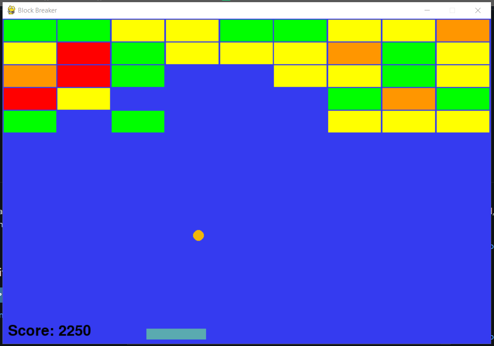
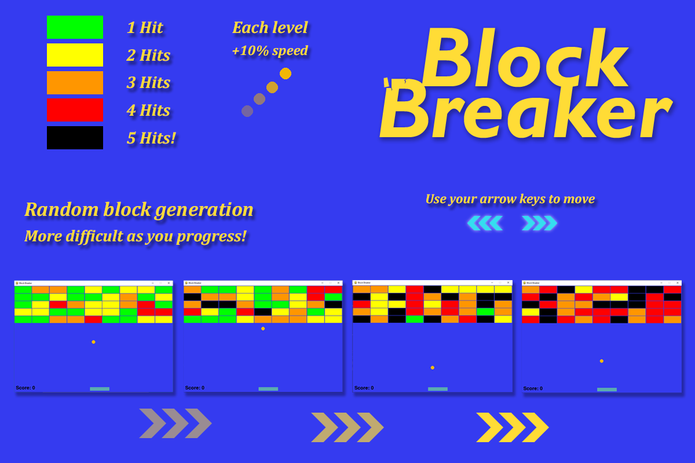
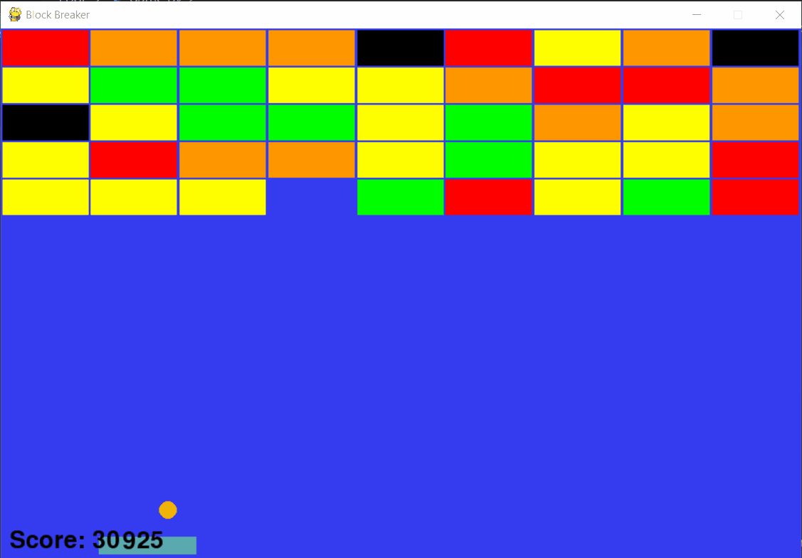

<a name="readme-top"></a>

<br />
<div align="center">
  <a href="https://github.com/JLavigueure/BlockBreaker">
    
  </a>

  <h3 align="center">Block Breaker</h3>

  <p align="center">
    Atari Breakout inspired, Block Breaker is an arcade game featuring AI.
    <br />
    <a href="https://github.com/JLavigueure/BlockBreaker/tree/main/code"><strong>Explore the docs »</strong></a>
    <br />
    <br />
    <a href="#ai-demo">View Demo</a>
    ·
    <a href="https://github.com/JLavigueure/BlockBreaker/issues">Report Bug</a>
    ·
    <a href="https://github.com/JLavigueure/BlockBreaker/issues">Request Feature</a>
  </p>
</div>

## About The Project

<div align="center">
  <a href="https://github.com/JLavigueure/BlockBreaker">
    
  </a>
</div>

You must break all the blocks with out dropping the ball. As you progress through levels, the speed of your ball and health of bricks will increase! Levels are randomly generated and become more difficult the further you get. 

<a name="ai-demo"></a>
### AI
Block breaker also comes equipped with an AI that can play for you. See it in action below. 
<div align="center">
  <a href="https://github.com/JLavigueure/BlockBreaker">
    
  </a>
</div>


<p align="right">(<a href="#readme-top">back to top</a>)</p>

### Built With

* 
* <a href="https://github.com/pygame/">Pygame</a>

### Skills
Obect oriented programming(OOP), graphics, AI

<p align="right">(<a href="#readme-top">back to top</a>)</p>

<!-- GETTING STARTED -->
## Getting Started

### Prerequisites
* <a href="https://pip.pypa.io/en/stable/cli/pip_install/">pip</a>
* <a href="https://www.python.org/downloads/">Python</a>


### Installation
1. Clone the repo in your designated folder
   ```sh
   git clone https://github.com/JLavigueure/BlockBreaker.git
   ```
2. Move into repo directory
   ```sh
   cd BlockBreaker/
   ```
 3. Install dependences with pip
    ```sh
    pip install -r requirements.txt
    ```
4. Run 
   ```sh
   python code/game.py
   ```
   NOTE: By default Ai is on. To turn off Ai, go into a game.py and set "AI = False"
  ```sh
   AI = False
   ```
<p align="right">(<a href="#readme-top">back to top</a>)</p>

<!-- CONTACT -->
## Contact

* Jordan Lavigueure
* lav.jordan@live.com
* <a href="https://www.linkedin.com/in/jordanlavigueure">
  
  </a>
* <a href="https://github.com/JLavigueure">
  
  </a>


<p align="right">(<a href="#readme-top">back to top</a>)</p>
